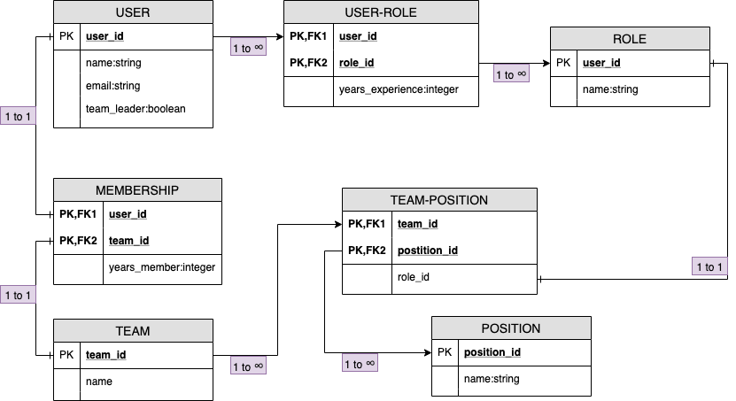

#  DevTeam
 A single page web app (SPA) for users to build teams utilizing Agile roles, using a Ruby on Rails API and a Javascript/React frontend.

### Ruby on Rails API backend
- Ruby 2.6.1p33
- Rails 6.0.1
- Pg 1.1.4

### Javascript and React frontend
- express
- lodash
- reactstrap
- semantic-ui-react
- uuid

### Demo
- The API has been launched to heroku.
- URL: https://devteamer.herokuapp.com
------------
### Front end repository
- URL: https://github.com/dannylee8/m5f
------------
### Walkthrough

###### Model diagram in UML

